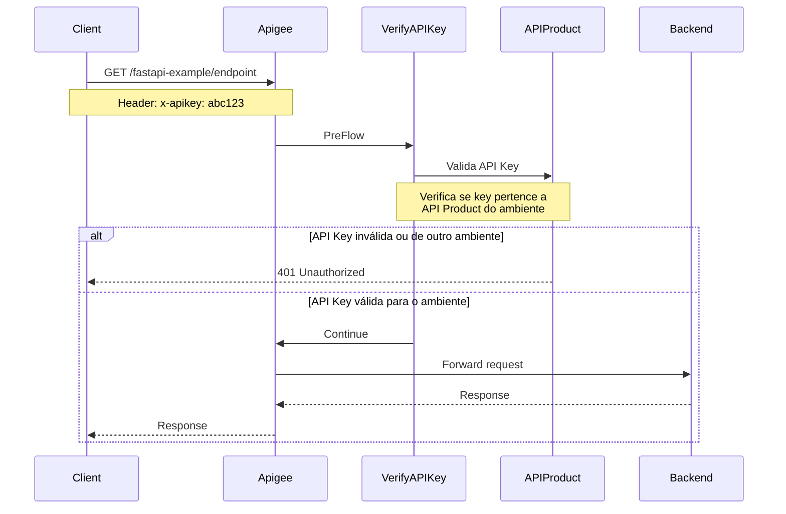

# GitOps Platform Engineering: Terragrunt + Atlantis + Backstage

## Visão Geral da Arquitetura

```
┌─────────────┐     ┌──────────────────┐     ┌─────────────────┐     ┌─────────┐
│  Backstage  │────▶│  GitHub PR       │────▶│  Atlantis       │────▶│  GCP    │
│  (Portal)   │     │  (gitops-*-infra)│     │  (Plan/Apply)   │     │         │
└─────────────┘     └──────────────────┘     └─────────────────┘     └─────────┘
```

**Fluxo:**
1. Dev preenche formulário no Backstage (bucket, pubsub, gke, sql...)
2. Backstage gera configuração Terragrunt e abre PR no repo correto
3. Atlantis detecta o PR, roda `terragrunt plan` e comenta no PR
4. Após aprovação e merge, Atlantis roda `terragrunt apply`
5. State é armazenado remotamente no GCS (um bucket por ambiente)

---

## Estrutura dos Repositórios GitOps

```
environments/
├── gcp/
│   ├── root.hcl
│   ├── dev/
│   │   ├── env_vars.hcl
│   │   ├── gcp-project.hcl
│   │   └── southamerica/
│   │       ├── gcp-region.hcl
│   │       ├── bucket/
│   │       │   ├── bucket01/
│   │       │   │   └── terragrunt.hcl
│   │       │   └── bucket02/
│   │       │       └── terragrunt.hcl
│   │       └── compute-engine/
│   │           ├── compute01/
│   │           │   └── terragrunt.hcl
│   │           └── compute02/
│   │               └── terragrunt.hcl
│   └── hml/
│       ├── env_vars.hcl
│       ├── gcp-project.hcl
│       └── southamerica/
│           ├── gcp-region.hcl
│           ├── bucket/
│           │   ├── bucket01/
│           │   │   └── terragrunt.hcl
│           │   └── bucket02/
│           │       └── terragrunt.hcl
│           └── compute-engine/
│               ├── compute01/
│               │   └── terragrunt.hcl
│               └── compute02/
│                   └── terragrunt.hcl
```

---

## State Management (Arquivos de Estado)

**Estratégia: 1 state file por recurso**

Cada pasta de recurso tem seu próprio `terragrunt.hcl` apontando para um bucket GCS dedicado ao ambiente. Isso garante:
- Isolamento total entre recursos
- Lock granular (sem contenção)
- Blast radius mínimo

### Buckets de State:
| Ambiente | Bucket de State |
|----------|----------------|
| dev | `gs://tfstate-dev-example` |
| hml | `gs://tfstate-hml-example` |

---

## Autenticação Multi-Ambiente

### Opção Recomendada: Workload Identity Federation (WIF)

Atlantis roda em GKE e usa **diferentes Service Accounts** por ambiente via WIF:

| Ambiente | GCP Project | Service Account |
|----------|------------|-----------------|
| dev | dev-project | atlantis-sa@dev-project.iam.gserviceaccount.com |
| hml | hml-project | atlantis-sa@hml-project.iam.gserviceaccount.com |

O Atlantis seleciona a SA correta baseado no path do workspace (extraído do `atlantis.yaml`).

---

## Instalação do Atlantis

Ver arquivos neste diretório:
- `atlantis/helm-values.yaml` - Instalação via Helm no GKE
- `atlantis/atlantis.yaml` - Configuração do repo
- `atlantis/server-side-repo-config.yaml` - Workflows customizados

---

## Manutenção

- **Upgrade:** Helm upgrade do chart
- **Logs:** `kubectl logs -f deploy/atlantis -n atlantis`
- **Lock de state:** Gerenciado automaticamente pelo GCS backend
- **Drift detection:** Cron job que roda `terragrunt plan` e alerta no Slack
- 

