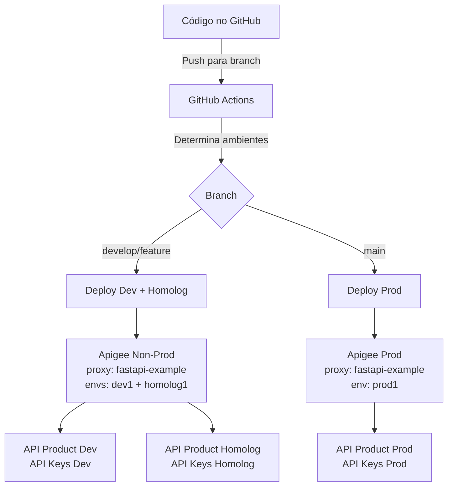
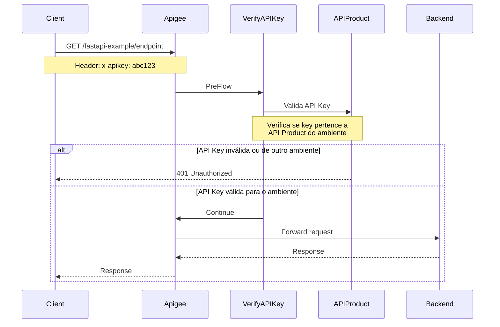
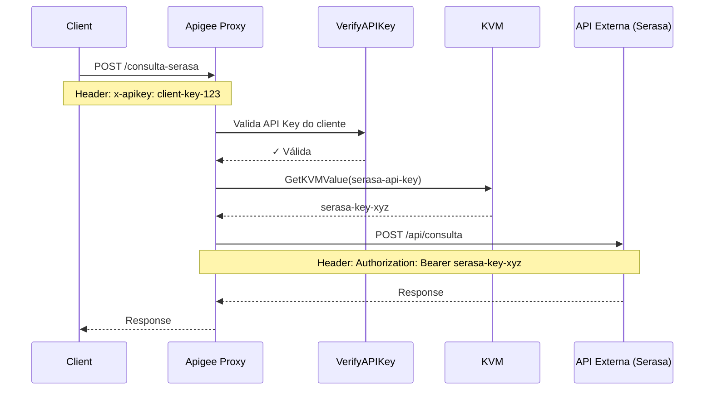
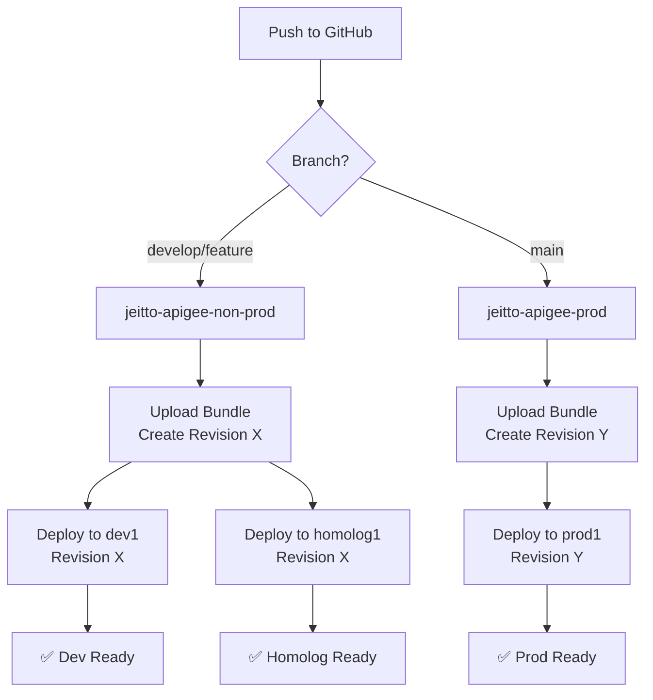
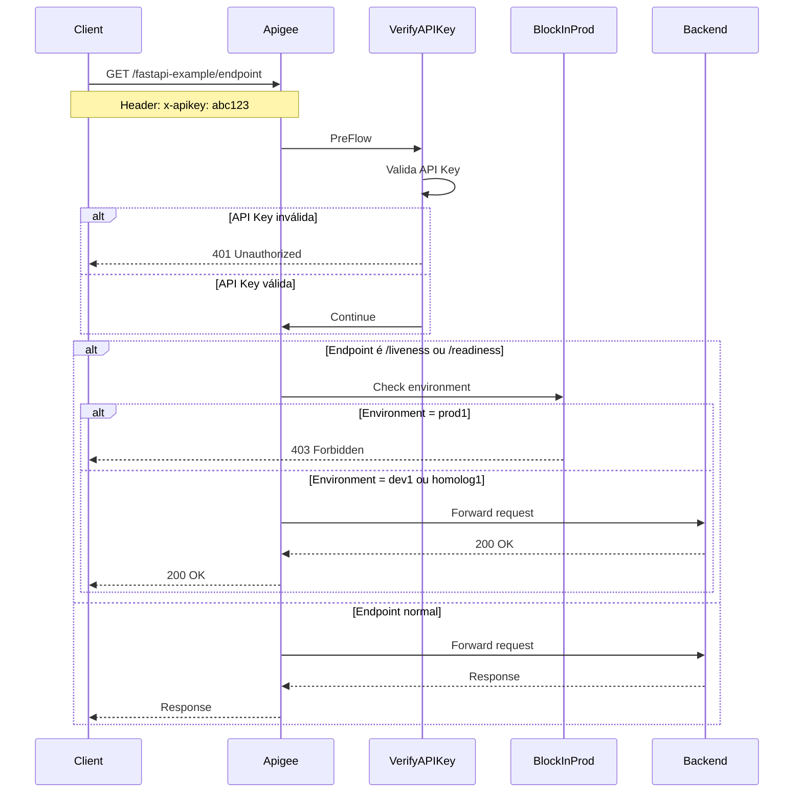

# RFC-004: Padronização de Proxies no Apigee

| Campo | Valor |
|-------|-------|
| **Status** | Draft |
| **Autor(es)** | Platform Engineering Team |
| **Data de Criação** | 2026-08-31 |
| **Última Atualização** | 2026-08-31 |
| **Reviewers** | Tech Leads, Backend Team, SRE, Segurança |
| **Pull Request** | *Será adicionado* |
| **Discussão** | *Será adicionada* |
| **Relacionado a** | RFC-001 (Backstage), RFC-002 (GitHub Actions) |

> 💬 **Feedback**: Esta RFC está em discussão! Participe:
> - 📝 **Code Review**: Comentários técnicos no Pull Request (link pendente)
> - 💭 **Discussão Geral**: Perguntas e sugestões na GitHub Discussion (link pendente)
> - 💬 **Chat**: Discussões rápidas no canal `#platform-engineering`
>
> **Prazo para feedback**: 2026-09-14

## Resumo

Esta RFC propõe um padrão unificado para criação, configuração e deployment de API Proxies no Apigee, garantindo consistência, segurança e governança em todos os ambientes (Dev, Homolog, Prod).

A proposta estabelece:
- **Convenções de nomenclatura** claras e previsíveis
- **Proxy único para múltiplos ambientes** (deploy simultâneo em dev1 e homolog1)
- **API Products segregados por ambiente** (API Keys não compartilhadas entre ambientes)
- **Autenticação via API Keys** obrigatória para todas as APIs
- **Integração com APIs externas** usando KVM (Key-Value Maps) para armazenar credenciais
- **Pipelines CI/CD automatizadas** para deployment consistente
- **Proteção de endpoints internos** (/liveness, /readiness, /docs bloqueados em produção)

Atualmente temos um exemplo funcional (`service-fastapi-example`) que implementa essas práticas. Esta RFC visa documentar, validar e oficializar este padrão para toda a organização.

## Motivação

### Problema

Atualmente enfrentamos os seguintes desafios:

1. **Falta de Padronização**: Cada time cria proxies de forma diferente, gerando inconsistência
2. **Risco de Segurança**: Nem todas as APIs possuem autenticação adequada
3. **Complexidade Operacional**: Gerenciamento manual de proxies em múltiplos ambientes
4. **Deploy Manual**: Processo sujeito a erros humanos e sem rastreabilidade
5. **Nomenclatura Inconsistente**: Dificuldade em identificar proxies e seus ambientes
6. **Exposição Indevida**: Endpoints internos (liveness, readiness) expostos em produção

### Objetivos

- ✅ **Padronizar** estrutura e nomenclatura de proxies no Apigee
- ✅ **Automatizar** deployment via GitHub Actions com GitOps
- ✅ **Garantir Segurança** com autenticação via API Key obrigatória
- ✅ **Simplificar Deploy** usando proxy único para múltiplos ambientes
- ✅ **Segregar API Keys** com API Products dedicados por ambiente
- ✅ **Proteger Credenciais Externas** usando KVM (Key-Value Maps)
- ✅ **Proteger Endpoints Internos** bloqueando health checks e docs em produção
- ✅ **Facilitar Governança** com estrutura previsível e rastreável
- ✅ **Reduzir Erros** eliminando configuração manual

### Não-Objetivos

- ❌ Migrar proxies existentes automaticamente (será feito gradualmente)
- ❌ Substituir o Apigee por outra solução de API Gateway
- ❌ Implementar outros métodos de autenticação neste momento (OAuth, JWT - futuro RFC)
- ❌ Gerenciar API Products e Developers (escopo de outra RFC)

## Proposta

### Visão Geral

Estabelecer um padrão obrigatório para todos os novos proxies no Apigee, baseado nas seguintes práticas:



### 1. Convenção de Nomenclatura de Proxies

#### Padrão de Nomes

**Importante**: Usamos um **único proxy** que pode ser deployado em múltiplos ambientes simultaneamente.

| Organização | Ambientes | Nome do Proxy | Exemplo |
|-------------|-----------|---------------|---------|
| **jeitto-apigee-non-prod** | dev1, homolog1 | `{service-name}` | `fastapi-example` |
| **jeitto-apigee-prod** | prod1 | `{service-name}` | `fastapi-example` |

**Vantagem**: Apigee permite fazer deploy do mesmo proxy em múltiplos ambientes. Assim, o proxy `fastapi-example` pode estar ativo simultaneamente nos ambientes `dev1` e `homolog1` da organização `jeitto-apigee-non-prod`.

#### Regras de Nomenclatura

- ✅ Usar **kebab-case** (lowercase com hífens)
- ✅ Nome deve ser **descritivo** do serviço
- ✅ Máximo de **30 caracteres**
- ✅ **SEM sufixos de ambiente** (ex: ~~-dev~~, ~~-homolog~~)
- ❌ Evitar prefixos genéricos (`api-`, `service-`)
- ❌ Evitar versões no nome (`v1`, `v2` - usar versionamento via path)

#### Base Path

O `BasePath` segue o mesmo padrão do nome do proxy:

```xml
<BasePath>/fastapi-example</BasePath>
```

**Regra**: O BasePath é sempre o mesmo em todos os ambientes. A diferença está no **hostname** da URL externa:

- Dev: `https://api-dev.jeitto.com.br/fastapi-example`
- Homolog: `https://api-hml.jeitto.com.br/fastapi-example`
- Prod: `https://api-prod.jeitto.com.br/fastapi-example`

### 2. Segregação de Ambientes

#### Estrutura de Organizações e Ambientes

**Modelo**: Um proxy, múltiplos ambientes

```
Apigee Organizações
├── jeitto-apigee-non-prod
│   ├── dev1 (ambiente)
│   │   └── fastapi-example (proxy - revision X)
│   └── homolog1 (ambiente)
│       └── fastapi-example (proxy - mesma revision X)
└── jeitto-apigee-prod
    └── prod1 (ambiente)
        └── fastapi-example (proxy - revision Y)
```

**Observação**: O Apigee permite que o mesmo proxy (com a mesma revision ou revisões diferentes) seja deployado em múltiplos ambientes simultaneamente dentro da mesma organização.

#### Mapeamento de Branches → Ambientes

| Branch Git | Organização Apigee | Ambientes Apigee | Nome do Proxy |
|------------|-------------------|-----------------|---------------|
| `develop`<br/>`feature/*` | jeitto-apigee-non-prod | dev1 + homolog1 | `{service-name}` |
| `main` | jeitto-apigee-prod | prod1 | `{service-name}` |

**Estratégia de Deploy**:
- Branch `develop` ou `feature/*`: Deploy automático em **dev1 e homolog1** simultaneamente
- Branch `main`: Deploy automático **apenas em prod1**

#### Target URLs por Ambiente

Mesmo que o proxy seja o mesmo, cada ambiente aponta para um target diferente:

| Ambiente | Load Balancer Interno | Padrão URL |
|----------|----------------------|-----------|
| Dev | `http://lb-dev.internal.jeitto.com` | `http://lb-dev.internal.jeitto.com/{basepath}` |
| Homolog | `http://lb-hml.internal.jeitto.com` | `http://lb-hml.internal.jeitto.com/{basepath}` |
| Prod | `http://lb-prod.internal.jeitto.com` | `http://lb-prod.internal.jeitto.com/{basepath}` |

**Como funciona**: O proxy usa variáveis de ambiente do Apigee (`environment.name`) para determinar qual target URL usar dinamicamente.

### 3. API Keys e API Products

#### 3.1. Política Obrigatória

Todos os proxies **DEVEM** implementar verificação de API Key no PreFlow:

```xml
<?xml version="1.0" encoding="UTF-8" standalone="yes"?>
<ProxyEndpoint name="default">
  <PreFlow name="PreFlow">
    <Request>
      <Step>
        <Name>VerifyAPIKey</Name>
      </Step>
    </Request>
    <Response/>
  </PreFlow>
  <!-- ... -->
</ProxyEndpoint>
```

#### 3.2. Arquivo de Policy: `VerifyAPIKey.xml`

```xml
<?xml version="1.0" encoding="UTF-8" standalone="yes"?>
<VerifyAPIKey continueOnError="false" enabled="true" name="VerifyAPIKey">
  <DisplayName>Verify API Key</DisplayName>
  <Properties/>
  <APIKey ref="request.header.x-apikey"/>
</VerifyAPIKey>
```

#### 3.3. Header Padrão

- **Nome do Header**: `x-apikey`
- **Localização**: Request Header
- **Obrigatório**: Sim
- **Formato**: String alfanumérica

#### 3.4. Segregação de API Products por Ambiente

**IMPORTANTE**: API Keys **NÃO são compartilhadas** entre ambientes. Cada ambiente possui seu próprio API Product.

##### Estrutura de API Products

Para cada proxy, devemos criar **3 API Products**, um para cada ambiente:

| API Product | Ambiente | Proxy Associado | Exemplo |
|-------------|----------|----------------|---------|
| `fastapi-example-dev` | dev1 | `fastapi-example` | API Keys válidas apenas em dev1 |
| `fastapi-example-homolog` | homolog1 | `fastapi-example` | API Keys válidas apenas em homolog1 |
| `fastapi-example-prod` | prod1 | `fastapi-example` | API Keys válidas apenas em prod1 |

##### Por que segregar API Products?

1. **Segurança**: API Keys de dev/homolog não funcionam em produção
2. **Isolamento**: Cada ambiente tem suas próprias quotas e rate limits
3. **Governança**: Controle granular de quem acessa cada ambiente
4. **Auditoria**: Rastreamento de uso por ambiente

##### Fluxo de Validação de API Key



#### 3.5. Gerenciamento de API Keys

##### Hierarquia no Apigee

```
Developer (desenvolvedor@jeitto.com)
└── App (My Application - Dev)
    └── API Product (fastapi-example-dev)
        ├── Proxy: fastapi-example
        ├── Environment: dev1
        └── API Key: abc123xyz (válida apenas para dev1)

Developer (desenvolvedor@jeitto.com)
└── App (My Application - Homolog)
    └── API Product (fastapi-example-homolog)
        ├── Proxy: fastapi-example
        ├── Environment: homolog1
        └── API Key: def456uvw (válida apenas para homolog1)
```

##### Criação de API Products

Para cada proxy, criar API Products com seguinte configuração:

**API Product Dev**:
```json
{
  "name": "fastapi-example-dev",
  "displayName": "FastAPI Example - Development",
  "approvalType": "auto",
  "environments": ["dev1"],
  "proxies": ["fastapi-example"],
  "quota": "1000",
  "quotaInterval": "1",
  "quotaTimeUnit": "minute"
}
```

**API Product Homolog**:
```json
{
  "name": "fastapi-example-homolog",
  "displayName": "FastAPI Example - Homologation",
  "approvalType": "auto",
  "environments": ["homolog1"],
  "proxies": ["fastapi-example"],
  "quota": "500",
  "quotaInterval": "1",
  "quotaTimeUnit": "minute"
}
```

**API Product Prod**:
```json
{
  "name": "fastapi-example-prod",
  "displayName": "FastAPI Example - Production",
  "approvalType": "manual",
  "environments": ["prod1"],
  "proxies": ["fastapi-example"],
  "quota": "10000",
  "quotaInterval": "1",
  "quotaTimeUnit": "minute"
}
```

**Observações**:
- `environments`: Define em qual ambiente a API Key é válida
- `approvalType`: `auto` para dev/homolog, `manual` para prod (requer aprovação)
- `quota`: Limites diferentes por ambiente

##### Provisionamento de API Keys

1. **Platform Engineering** cria os API Products
2. **Desenvolvedores** solicitam acesso criando um App no Apigee Portal
3. **App** é associado ao API Product do ambiente desejado
4. **API Key** é gerada automaticamente (ou requer aprovação em prod)
5. **Desenvolvedor** usa a API Key no header `x-apikey`

#### 3.6. Exceções (Endpoints sem API Key)

Apenas endpoints internos de health check podem **não** requerer API Key:
- `/liveness` - Verificação de estado do container
- `/readiness` - Verificação de prontidão do serviço
- `/docs` - Documentação Swagger/OpenAPI (apenas dev/homolog)

**Importante**: Estes endpoints devem ser **bloqueados em produção** (ver seção 4).

### 4. Proteção de Endpoints Internos

#### 4.1. Bloqueio de Endpoints em Produção

Certos endpoints são úteis apenas em ambientes de desenvolvimento/homologação e **NÃO** devem ser expostos em produção:

- `/liveness` - Health check do Kubernetes
- `/readiness` - Readiness probe do Kubernetes  
- `/docs` - Documentação Swagger/OpenAPI (FastAPI, etc)

**Policy**: `BlockInProd.xml`

```xml
<?xml version="1.0" encoding="UTF-8" standalone="yes"?>
<RaiseFault continueOnError="false" enabled="true" name="BlockInProd">
  <DisplayName>Block endpoint in Production</DisplayName>
  <FaultResponse>
    <Set>
      <StatusCode>403</StatusCode>
      <ReasonPhrase>Forbidden</ReasonPhrase>
    </Set>
    <Set>
      <Payload contentType="application/json">
        {
          "error": "This endpoint is not available in production",
          "message": "Internal endpoints are blocked in production environment"
        }
      </Payload>
    </Set>
  </FaultResponse>
</RaiseFault>
```

#### 4.2. Aplicação nos Flows

**Liveness Check**:

```xml
<Flow name="Liveness Check">
  <Description>Health check endpoint - liveness (only Dev and Homolog)</Description>
  <Request>
    <Step>
      <Name>BlockInProd</Name>
      <Condition>environment.name = "prod1"</Condition>
    </Step>
  </Request>
  <Response/>
  <Condition>(proxy.pathsuffix MatchesPath "/liveness") and (request.verb = "GET")</Condition>
</Flow>
```

**Readiness Check**:

```xml
<Flow name="Readiness Check">
  <Description>Readiness check endpoint - readiness (only Dev and Homolog)</Description>
  <Request>
    <Step>
      <Name>BlockInProd</Name>
      <Condition>environment.name = "prod1"</Condition>
    </Step>
  </Request>
  <Response/>
  <Condition>(proxy.pathsuffix MatchesPath "/readiness") and (request.verb = "GET")</Condition>
</Flow>
```

**API Documentation (FastAPI/Swagger)**:

```xml
<Flow name="API Documentation">
  <Description>Swagger/OpenAPI documentation (only Dev and Homolog)</Description>
  <Request>
    <Step>
      <Name>BlockInProd</Name>
      <Condition>environment.name = "prod1"</Condition>
    </Step>
  </Request>
  <Response/>
  <Condition>(proxy.pathsuffix MatchesPath "/docs") and (request.verb = "GET")</Condition>
</Flow>
```

**Variações de /docs** (incluir conforme necessário):

```xml
<Flow name="OpenAPI JSON">
  <Description>OpenAPI JSON schema (only Dev and Homolog)</Description>
  <Request>
    <Step>
      <Name>BlockInProd</Name>
      <Condition>environment.name = "prod1"</Condition>
    </Step>
  </Request>
  <Response/>
  <Condition>(proxy.pathsuffix MatchesPath "/openapi.json") and (request.verb = "GET")</Condition>
</Flow>
```

#### 4.3. Roteamento de Readiness

O endpoint `/readiness` deve ser roteado para um **TargetEndpoint separado** que chama o health check interno do Kubernetes:

```xml
<RouteRule name="readiness-route">
  <Condition>(proxy.pathsuffix MatchesPath "/readiness") and (request.verb = "GET")</Condition>
  <TargetEndpoint>readiness</TargetEndpoint>
</RouteRule>
```

**Target**: `targets/readiness.xml`

```xml
<?xml version="1.0" encoding="UTF-8" standalone="yes"?>
<TargetEndpoint name="readiness">
  <Description>Internal readiness check</Description>
  <HTTPTargetConnection>
    <URL>http://{service-name}.{namespace}.svc.cluster.local:8080/{basepath}/readiness</URL>
  </HTTPTargetConnection>
</TargetEndpoint>
```

### 5. Integração com APIs Externas usando KVM

#### 5.1. Caso de Uso: Chamar API Externa (ex: Serasa)

Quando o proxy precisa chamar uma API externa que requer autenticação (ex: Serasa, Unico, etc), **NÃO devemos** armazenar credenciais no código ou variáveis de ambiente. 

**Solução**: Usar **KVM (Key-Value Maps)** do Apigee para armazenar credenciais de forma segura e criptografada.

#### 5.2. Arquitetura do Fluxo



#### 5.3. Criação de KVM

##### Estrutura de KVMs por Ambiente

KVMs devem ser criados **por ambiente** para segregar credenciais:

| KVM Name | Escopo | Ambiente | Conteúdo |
|----------|--------|----------|----------|
| `external-apis-dev` | environment | dev1 | Credenciais de dev das APIs externas |
| `external-apis-homolog` | environment | homolog1 | Credenciais de homolog das APIs externas |
| `external-apis-prod` | environment | prod1 | Credenciais de prod das APIs externas |

##### Exemplo de Conteúdo do KVM

```json
{
  "serasa-api-key": "dev-serasa-key-12345",
  "serasa-base-url": "https://api-dev.serasa.com.br",
  "unico-api-key": "dev-unico-key-67890",
  "unico-base-url": "https://sandbox.unico.com.br"
}
```

##### Criação via API Management API

```bash
# Criar KVM encrypted no ambiente dev1
curl -X POST \
  "https://apigee.googleapis.com/v1/organizations/jeitto-apigee-non-prod/environments/dev1/keyvaluemaps" \
  -H "Authorization: Bearer $TOKEN" \
  -H "Content-Type: application/json" \
  -d '{
    "name": "external-apis-dev",
    "encrypted": true
  }'

# Adicionar entrada no KVM
curl -X POST \
  "https://apigee.googleapis.com/v1/organizations/jeitto-apigee-non-prod/environments/dev1/keyvaluemaps/external-apis-dev/entries" \
  -H "Authorization: Bearer $TOKEN" \
  -H "Content-Type: application/json" \
  -d '{
    "name": "serasa-api-key",
    "value": "dev-serasa-key-12345"
  }'
```

#### 5.4. Policy para Recuperar Credencial do KVM

**Policy**: `policies/GetSerasaAPIKey.xml`

```xml
<?xml version="1.0" encoding="UTF-8" standalone="yes"?>
<KeyValueMapOperations async="false" continueOnError="false" enabled="true" name="GetSerasaAPIKey" mapIdentifier="external-apis-{environment.name}">
  <DisplayName>Get Serasa API Key from KVM</DisplayName>
  <Properties/>
  <ExpiryTimeInSecs>300</ExpiryTimeInSecs>
  <Get assignTo="private.serasa.apikey" index="1">
    <Key>
      <Parameter>serasa-api-key</Parameter>
    </Key>
  </Get>
  <Get assignTo="private.serasa.baseurl" index="2">
    <Key>
      <Parameter>serasa-base-url</Parameter>
    </Key>
  </Get>
  <Scope>environment</Scope>
</KeyValueMapOperations>
```

**Observações**:
- `mapIdentifier="external-apis-{environment.name}"`: Seleciona o KVM correto baseado no ambiente (dev1, homolog1, prod1)
- `assignTo="private.serasa.apikey"`: Armazena o valor em uma variável privada (não exposta)
- `ExpiryTimeInSecs`: Cache por 5 minutos para performance
- `Scope="environment"`: KVM é específico do ambiente

#### 5.5. Policy para Adicionar API Key no Request

**Policy**: `policies/SetSerasaAPIKey.xml`

```xml
<?xml version="1.0" encoding="UTF-8" standalone="yes"?>
<AssignMessage async="false" continueOnError="false" enabled="true" name="SetSerasaAPIKey">
  <DisplayName>Set Serasa API Key Header</DisplayName>
  <Set>
    <Headers>
      <Header name="Authorization">Bearer {private.serasa.apikey}</Header>
    </Headers>
  </Set>
  <IgnoreUnresolvedVariables>false</IgnoreUnresolvedVariables>
  <AssignTo createNew="false" transport="http" type="request"/>
</AssignMessage>
```

#### 5.6. Flow Completo para Chamada Externa

**ProxyEndpoint**: `proxies/default.xml`

```xml
<Flow name="Consulta Serasa">
  <Description>Proxy para consulta na API do Serasa</Description>
  <Request>
    <!-- 1. Validar API Key do cliente -->
    <Step>
      <Name>VerifyAPIKey</Name>
    </Step>
    
    <!-- 2. Recuperar credencial do Serasa do KVM -->
    <Step>
      <Name>GetSerasaAPIKey</Name>
    </Step>
    
    <!-- 3. Adicionar API Key do Serasa no request -->
    <Step>
      <Name>SetSerasaAPIKey</Name>
    </Step>
  </Request>
  <Response/>
  <Condition>(proxy.pathsuffix MatchesPath "/consulta-serasa") and (request.verb = "POST")</Condition>
</Flow>
```

**TargetEndpoint**: `targets/serasa.xml`

```xml
<?xml version="1.0" encoding="UTF-8" standalone="yes"?>
<TargetEndpoint name="serasa">
  <Description>Target para API do Serasa</Description>
  <HTTPTargetConnection>
    <Properties/>
    <URL>{private.serasa.baseurl}/api/consulta</URL>
  </HTTPTargetConnection>
</TargetEndpoint>
```

**RouteRule**:

```xml
<RouteRule name="serasa-route">
  <Condition>(proxy.pathsuffix MatchesPath "/consulta-serasa") and (request.verb = "POST")</Condition>
  <TargetEndpoint>serasa</TargetEndpoint>
</RouteRule>
```

#### 5.7. Exemplo Completo: Proxy com API Externa

**Estrutura de Diretórios**:

```
apiproxy/
├── fastapi-example.xml
├── proxies/
│   └── default.xml                      # ProxyEndpoint
├── targets/
│   ├── default.xml                      # Backend interno (K8s)
│   ├── readiness.xml                    # Health check
│   └── serasa.xml                       # API Externa (Serasa)
└── policies/
    ├── VerifyAPIKey.xml                 # Validação de API Key do cliente
    ├── BlockInProd.xml                  # Bloqueio de endpoints internos
    ├── GetSerasaAPIKey.xml              # Recuperar credencial do KVM
    └── SetSerasaAPIKey.xml              # Adicionar credencial no request
```

**Fluxo de Requisição**:

1. Cliente chama: `POST https://api-dev.jeitto.com.br/fastapi-example/consulta-serasa`
2. Apigee valida `x-apikey` do cliente (VerifyAPIKey)
3. Apigee recupera credencial do Serasa do KVM `external-apis-dev` (GetSerasaAPIKey)
4. Apigee adiciona `Authorization: Bearer serasa-key-xyz` no request (SetSerasaAPIKey)
5. Apigee chama API do Serasa: `POST https://api-dev.serasa.com.br/api/consulta`
6. Serasa responde para Apigee
7. Apigee retorna resposta para o cliente

#### 5.8. Boas Práticas com KVM

1. **Sempre usar KVM encrypted** para credenciais sensíveis
2. **KVMs separados por ambiente** (não compartilhar credenciais entre dev/homolog/prod)
3. **Naming convention**: `{categoria}-{ambiente}` (ex: `external-apis-dev`)
4. **Usar variáveis privadas** (`private.*`) para não expor credenciais em logs
5. **Habilitar cache** (`ExpiryTimeInSecs`) para melhorar performance
6. **Rotação de credenciais**: Atualizar KVM via API quando credenciais mudarem
7. **Controle de acesso**: Apenas Platform Engineering pode criar/editar KVMs

### 6. Pipelines CI/CD

#### 6.1. Estrutura do Workflow

Arquivo: `.github/workflows/proxy-ci.yaml`

```yaml
name: "Apigee Deployment"

on:
  workflow_dispatch:
  push:
    branches:
      - 'develop'
      - 'main'
      - 'feature/*'
    paths:
      - 'apiproxy/**'
      - '.github/workflows/proxy-ci.yaml'

env:
  PROXY_NAME: fastapi-example
  PROXY_BASE_PATH: fastapi-example
```

#### 6.2. Determinação de Ambientes

**Importante**: Deploy em múltiplos ambientes simultaneamente quando em branch develop/feature.

```yaml
- name: Determine Environments
  id: env
  run: |
    BRANCH_NAME="${GITHUB_REF#refs/heads/}"
    
    if [[ "$BRANCH_NAME" == "main" ]]; then
      # Produção: deploy apenas em prod1
      echo "APIGEE_ORG=jeitto-apigee-prod" >> $GITHUB_OUTPUT
      echo "APIGEE_ENVS=prod1" >> $GITHUB_OUTPUT
      echo "TARGET_URL_PROD=http://lb-prod.internal.jeitto.com/${{ env.PROXY_BASE_PATH }}" >> $GITHUB_OUTPUT
      echo "ENV_NAME=PROD" >> $GITHUB_OUTPUT
      echo "WORKLOAD_IDENTITY=${{ secrets.WORKLOAD_IDENTITY_POOL_ID_PROD }}" >> $GITHUB_OUTPUT
      echo "SERVICE_ACCOUNT=${{ secrets.SERVICE_ACCOUNT_PROD }}" >> $GITHUB_OUTPUT
      echo "EXTERNAL_URL_PROD=https://api-prod.jeitto.com.br/${{ env.PROXY_BASE_PATH }}" >> $GITHUB_OUTPUT
    else
      # Não-Produção: deploy em dev1 E homolog1 simultaneamente
      echo "APIGEE_ORG=jeitto-apigee-non-prod" >> $GITHUB_OUTPUT
      echo "APIGEE_ENVS=dev1,homolog1" >> $GITHUB_OUTPUT
      echo "TARGET_URL_DEV=http://lb-dev.internal.jeitto.com/${{ env.PROXY_BASE_PATH }}" >> $GITHUB_OUTPUT
      echo "TARGET_URL_HOMOLOG=http://lb-hml.internal.jeitto.com/${{ env.PROXY_BASE_PATH }}" >> $GITHUB_OUTPUT
      echo "ENV_NAME=NON-PROD" >> $GITHUB_OUTPUT
      echo "WORKLOAD_IDENTITY=${{ secrets.WORKLOAD_IDENTITY_POOL_ID_NON_PROD }}" >> $GITHUB_OUTPUT
      echo "SERVICE_ACCOUNT=${{ secrets.SERVICE_ACCOUNT_NON_PROD }}" >> $GITHUB_OUTPUT
      echo "EXTERNAL_URL_DEV=https://api-dev.jeitto.com.br/${{ env.PROXY_BASE_PATH }}" >> $GITHUB_OUTPUT
      echo "EXTERNAL_URL_HOMOLOG=https://api-hml.jeitto.com.br/${{ env.PROXY_BASE_PATH }}" >> $GITHUB_OUTPUT
    fi
    
    echo "📋 Deploying to: $ENV_NAME"
    echo "📦 Proxy Name: ${{ env.PROXY_NAME }}"
    echo "🌍 Environments: $APIGEE_ENVS"
```

#### 6.3. Autenticação via Workload Identity

```yaml
- name: Authenticate to Google Cloud
  id: auth
  uses: google-github-actions/auth@v1
  with:
    token_format: "access_token"
    create_credentials_file: true
    workload_identity_provider: ${{ steps.env.outputs.WORKLOAD_IDENTITY }}
    service_account: ${{ steps.env.outputs.SERVICE_ACCOUNT }}
```

**Secrets Necessários**:
- `WORKLOAD_IDENTITY_POOL_ID_PROD`
- `WORKLOAD_IDENTITY_POOL_ID_NON_PROD`
- `SERVICE_ACCOUNT_PROD`
- `SERVICE_ACCOUNT_NON_PROD`

#### 6.4. Criação e Upload do Bundle

```yaml
- name: Create API Bundle
  run: |
    zip -r proxy.zip apiproxy -x "*.bak"
    echo "✅ Bundle created: proxy.zip"

- name: Upload API Proxy Bundle
  id: upload
  run: |
    TOKEN="${{ steps.auth.outputs.access_token }}"
    
    RESPONSE=$(curl -s -w "\n%{http_code}" -X POST \
      "https://apigee.googleapis.com/v1/organizations/${{ steps.env.outputs.APIGEE_ORG }}/apis?action=import&name=${{ env.PROXY_NAME }}" \
      -H "Authorization: Bearer $TOKEN" \
      -H "Content-Type: multipart/form-data" \
      -F "file=@proxy.zip")
    
    HTTP_CODE=$(echo "$RESPONSE" | tail -n1)
    BODY=$(echo "$RESPONSE" | sed '$d')
    
    if [[ "$HTTP_CODE" != "200" && "$HTTP_CODE" != "201" ]]; then
      echo "❌ Upload failed with status $HTTP_CODE"
      echo "$BODY"
      exit 1
    fi
    
    REVISION=$(echo "$BODY" | jq -r '.revision')
    echo "REVISION=$REVISION" >> $GITHUB_OUTPUT
    echo "✅ Uploaded proxy revision: $REVISION"
```

#### 6.5. Deploy em Múltiplos Ambientes

```yaml
- name: Deploy to Environments
  run: |
    TOKEN="${{ steps.auth.outputs.access_token }}"
    REVISION="${{ steps.upload.outputs.REVISION }}"
    IFS=',' read -ra ENVS <<< "${{ steps.env.outputs.APIGEE_ENVS }}"
    
    for ENV in "${ENVS[@]}"; do
      echo "🚀 Deploying to environment: $ENV"
      
      RESPONSE=$(curl -s -w "\n%{http_code}" -X POST \
        "https://apigee.googleapis.com/v1/organizations/${{ steps.env.outputs.APIGEE_ORG }}/environments/$ENV/apis/${{ env.PROXY_NAME }}/revisions/$REVISION/deployments?override=true" \
        -H "Authorization: Bearer $TOKEN")
      
      HTTP_CODE=$(echo "$RESPONSE" | tail -n1)
      BODY=$(echo "$RESPONSE" | sed '$d')
      
      if [[ "$HTTP_CODE" != "200" && "$HTTP_CODE" != "201" ]]; then
        echo "❌ Deploy to $ENV failed with status $HTTP_CODE"
        echo "$BODY"
        exit 1
      fi
      
      echo "✅ Successfully deployed to $ENV"
    done
```

#### 6.6. Resumo de Deploy

```yaml
- name: Deployment Summary
  if: success()
  run: |
    echo "━━━━━━━━━━━━━━━━━━━━━━━━━━━━━━━━━━━━━━━━━━━"
    echo "✅ DEPLOYMENT SUCCESSFUL"
    echo "━━━━━━━━━━━━━━━━━━━━━━━━━━━━━━━━━━━━━━━━━━━"
    echo "📦 Proxy: ${{ env.PROXY_NAME }}"
    echo "📋 Revision: ${{ steps.upload.outputs.REVISION }}"
    echo "🏢 Organization: ${{ steps.env.outputs.APIGEE_ORG }}"
    echo "🌍 Environments: ${{ steps.env.outputs.APIGEE_ENVS }}"
    echo ""
    echo "🔗 External URLs:"
    
    if [[ "${{ steps.env.outputs.ENV_NAME }}" == "PROD" ]]; then
      echo "   Prod: ${{ steps.env.outputs.EXTERNAL_URL_PROD }}"
    else
      echo "   Dev: ${{ steps.env.outputs.EXTERNAL_URL_DEV }}"
      echo "   Homolog: ${{ steps.env.outputs.EXTERNAL_URL_HOMOLOG }}"
    fi
    echo "━━━━━━━━━━━━━━━━━━━━━━━━━━━━━━━━━━━━━━━━━━━"
```

#### 6.7. Fluxo de Deploy



**Observações**:
- Branches `develop` e `feature/*`: Deploy **simultâneo** em dev1 e homolog1
- Branch `main`: Deploy **apenas** em prod1
- Mesma revision deployada em dev1 e homolog1
- Revision de prod pode ser diferente (independente)

### 7. Estrutura de Diretórios Padrão

```
repositório-do-serviço/
├── apiproxy/
│   ├── {service-name}.xml              # Configuração principal do proxy
│   ├── proxies/
│   │   └── default.xml                 # ProxyEndpoint principal
│   ├── targets/
│   │   ├── default.xml                 # TargetEndpoint padrão
│   │   └── readiness.xml               # TargetEndpoint para readiness
│   └── policies/
│       ├── VerifyAPIKey.xml            # Policy de autenticação
│       ├── BlockInProd.xml             # Policy de bloqueio em prod
│       └── RewriteReadinessPath.xml    # (opcional) Rewrite de path
└── .github/
    └── workflows/
        └── proxy-ci.yaml               # Pipeline de deployment
```

## Design Técnico

### Arquivo Principal do Proxy

`apiproxy/{service-name}.xml`:

```xml
<?xml version="1.0" encoding="UTF-8" standalone="yes"?>
<APIProxy revision="1" name="{service-name}">
  <DisplayName>{Service Display Name}</DisplayName>
  <Description>{Service Description} with API Key authentication</Description>
  <BasePaths>/{service-name}</BasePaths>
  <Policies>
    <Policy>VerifyAPIKey</Policy>
    <Policy>RewriteReadinessPath</Policy>
    <Policy>BlockInProd</Policy>
  </Policies>
  <ProxyEndpoints>
    <ProxyEndpoint>default</ProxyEndpoint>
  </ProxyEndpoints>
  <TargetEndpoints>
    <TargetEndpoint>default</TargetEndpoint>
    <TargetEndpoint>readiness</TargetEndpoint>
  </TargetEndpoints>
</APIProxy>
```

### ProxyEndpoint Completo

`apiproxy/proxies/default.xml`:

```xml
<?xml version="1.0" encoding="UTF-8" standalone="yes"?>
<ProxyEndpoint name="default">
  <PreFlow name="PreFlow">
    <Request>
      <Step>
        <Name>VerifyAPIKey</Name>
      </Step>
    </Request>
    <Response/>
  </PreFlow>
  
  <Flows>
    <Flow name="Liveness Check">
      <Description>Health check endpoint - liveness (only Dev and Homolog)</Description>
      <Request>
        <Step>
          <Name>BlockInProd</Name>
          <Condition>environment.name = "prod1"</Condition>
        </Step>
      </Request>
      <Response/>
      <Condition>(proxy.pathsuffix MatchesPath "/liveness") and (request.verb = "GET")</Condition>
    </Flow>
    
    <Flow name="Readiness Check">
      <Description>Readiness check endpoint - readiness (only Dev and Homolog)</Description>
      <Request>
        <Step>
          <Name>BlockInProd</Name>
          <Condition>environment.name = "prod1"</Condition>
        </Step>
      </Request>
      <Response/>
      <Condition>(proxy.pathsuffix MatchesPath "/readiness") and (request.verb = "GET")</Condition>
    </Flow>
  </Flows>
  
  <PostFlow name="PostFlow">
    <Request/>
    <Response/>
  </PostFlow>
  
  <HTTPProxyConnection>
    <BasePath>/{service-name}</BasePath>
  </HTTPProxyConnection>
  
  <RouteRule name="readiness-route">
    <Condition>(proxy.pathsuffix MatchesPath "/readiness") and (request.verb = "GET")</Condition>
    <TargetEndpoint>readiness</TargetEndpoint>
  </RouteRule>
  
  <RouteRule name="default">
    <TargetEndpoint>default</TargetEndpoint>
  </RouteRule>
</ProxyEndpoint>
```

### Diagrama de Fluxo de Requisição



## Alternativas Consideradas

### Alternativa 1: Proxies Separados por Ambiente

**Descrição**: Criar proxies completamente separados para cada ambiente (ex: `fastapi-example-dev`, `fastapi-example-homolog`, `fastapi-example`).

**Prós**:
- ✅ Isolamento total entre ambientes
- ✅ Zero risco de impacto entre ambientes

**Contras**:
- ❌ Mais proxies para gerenciar (3x mais)
- ❌ Duplicação de configuração
- ❌ Dificuldade em manter consistência entre ambientes
- ❌ Mais complexidade na pipeline (nomes diferentes)

**Avaliação**: ❌ **Rejeitada** - O Apigee suporta deploy do mesmo proxy em múltiplos ambientes, aproveitando essa feature nativa reduzimos complexidade e mantemos consistência.

### Alternativa 2: API Products Compartilhados entre Ambientes

**Descrição**: Usar um único API Product com API Keys válidas em todos os ambientes.

**Prós**:
- ✅ Menos API Products para gerenciar
- ✅ Mesma API Key funciona em dev/homolog/prod

**Contras**:
- ❌ **RISCO DE SEGURANÇA**: API Keys de dev funcionariam em prod
- ❌ Impossível ter quotas diferentes por ambiente
- ❌ Dificuldade em auditoria e rastreamento
- ❌ Violação do princípio de menor privilégio

**Avaliação**: ❌ **Rejeitada** - Segurança é prioridade. API Keys devem ser segregadas por ambiente.

### Alternativa 3: OAuth 2.0 / JWT ao invés de API Keys

**Descrição**: Usar OAuth 2.0 ou JWT para autenticação.

**Prós**:
- ✅ Mais seguro (tokens com expiração)
- ✅ Suporte a escopos e permissões granulares
- ✅ Padrão da indústria

**Contras**:
- ❌ Maior complexidade de implementação
- ❌ Requer infraestrutura adicional (Authorization Server)
- ❌ Curva de aprendizado maior para times

**Avaliação**: ⏸️ **Adiada para RFC futura** - API Keys são suficientes para começar. OAuth/JWT será proposto quando tivermos casos de uso que justifiquem a complexidade.

### Alternativa 4: Hardcoded Credentials ao invés de KVM

**Descrição**: Armazenar credenciais de APIs externas diretamente no código ou variáveis de ambiente.

**Prós**:
- ✅ Mais simples de implementar

**Contras**:
- ❌ **RISCO CRÍTICO DE SEGURANÇA**: Credenciais expostas no código
- ❌ Dificulta rotação de credenciais
- ❌ Credenciais podem vazar em logs
- ❌ Não há criptografia

**Avaliação**: ❌ **Rejeitada** - KVM encrypted é obrigatório para credenciais sensíveis.

### Alternativa 5: Terraform/IaC para Deploy

**Descrição**: Usar Terraform para gerenciar proxies como código.

**Prós**:
- ✅ Infraestrutura como código
- ✅ State management
- ✅ Reutilização via módulos

**Contras**:
- ❌ Apigee API tem limitações com Terraform
- ❌ Complexidade adicional
- ❌ GitHub Actions + API REST é mais direto

**Avaliação**: ❌ **Rejeitada** - GitHub Actions com Apigee API REST é mais simples e atende às necessidades atuais.

### Alternativa 4: Deployment Manual via Console

**Descrição**: Continuar usando o Console do Apigee para deploy manual.

**Prós**:
- ✅ Interface visual
- ✅ Sem necessidade de pipeline

**Contras**:
- ❌ Propenso a erros humanos
- ❌ Sem versionamento
- ❌ Sem rastreabilidade
- ❌ Dificuldade de rollback
- ❌ Não escalável

**Avaliação**: ❌ **Rejeitada** - GitOps é fundamental para governança e confiabilidade.

## Impacto

### Impacto em Sistemas Existentes

#### Novos Serviços
- ✅ **Positivo**: Template claro e pronto para uso
- ✅ **Positivo**: Onboarding mais rápido

#### Serviços Existentes
- ⚠️ **Neutro**: Não são obrigados a migrar imediatamente
- ℹ️ **Recomendação**: Migrar gradualmente conforme necessidade
- 📋 **Plano**: Criar migration guide separado

#### Infraestrutura
- ✅ **Positivo**: Melhor organização e governança
- ✅ **Positivo**: Redução de configurações ad-hoc
- ⚠️ **Neutro**: Requer manutenção de secrets do GitHub

### Impacto em Times/Usuários

#### Desenvolvedores Backend
- ✅ **Positivo**: Processo claro e documentado
- ✅ **Positivo**: Menos tempo gasto com configuração manual
- ⚠️ **Neutro**: Curva de aprendizado inicial (mitigada com docs)
- 📚 **Ação**: Criar tutorial passo-a-passo

#### Platform Engineering
- ✅ **Positivo**: Padronização facilita suporte
- ✅ **Positivo**: Menos configurações manuais
- ⚠️ **Neutro**: Responsabilidade por manter pipeline template
- 🔧 **Ação**: Criar Backstage template

#### SRE/Operações
- ✅ **Positivo**: Troubleshooting mais fácil (estrutura previsível)
- ✅ **Positivo**: Melhoria na rastreabilidade
- ✅ **Positivo**: Rollback automatizado

#### Segurança
- ✅ **Positivo**: API Keys obrigatórias por padrão
- ✅ **Positivo**: Endpoints internos protegidos
- ✅ **Positivo**: Auditoria via GitHub commits

#### Consumidores de APIs (Frontend, Mobile, Integrações)
- ⚠️ **Impacto**: Precisam usar `x-apikey` header
- 📋 **Ação**: Documentar no API Portal
- 💡 **Benefício**: APIs mais seguras

## Plano de Implementação

### Fase 1: Validação e Documentação (Semanas 1-2)

**Objetivos**:
- Validar RFC com stakeholders
- Criar documentação completa

**Tarefas**:
- [ ] Review da RFC por Tech Leads
- [ ] Aprovação da RFC
- [ ] Criar tutorial no docs: "Como criar proxy no Apigee"
- [ ] Criar how-to guide: "Deploy de proxy via GitHub Actions"
- [ ] Atualizar reference: "Apigee proxy structure"

**Critério de Sucesso**: RFC aprovada e documentação publicada no Backstage

### Fase 2: Template no Backstage (Semanas 3-4)

**Objetivos**:
- Criar Software Template no Backstage
- Automatizar criação de repositórios com estrutura padrão

**Tarefas**:
- [ ] Criar template `apigee-proxy-template` no Backstage
- [ ] Incluir:
  - Estrutura `apiproxy/` completa
  - Workflow `.github/workflows/proxy-ci.yaml`
  - README com instruções
  - Arquivo `catalog-info.yaml`
- [ ] Testar criação de novo proxy via template
- [ ] Documentar uso do template

**Critério de Sucesso**: Novo proxy criado via template em < 5 minutos

### Fase 3: Projeto Piloto (Semanas 5-6)

**Objetivos**:
- Validar padrão com projeto real
- Identificar gaps e melhorias

**Tarefas**:
- [ ] Selecionar 2-3 novos serviços para piloto
- [ ] Implementar proxies seguindo RFC
- [ ] Deploy em Dev → Homolog → Prod
- [ ] Coletar feedback dos times
- [ ] Ajustar documentação conforme aprendizados

**Critério de Sucesso**: 3 proxies em produção usando o padrão

### Fase 4: Migração Gradual (Meses 2-4)

**Objetivos**:
- Migrar proxies existentes (quando necessário)
- Deprecar configurações antigas

**Tarefas**:
- [ ] Criar migration guide para proxies existentes
- [ ] Identificar proxies críticos para migrar
- [ ] Agendar janelas de migração
- [ ] Executar migrações com rollback plan
- [ ] Monitorar e validar pós-migração

**Critério de Sucesso**: 80% dos proxies ativos seguindo o padrão

### Fase 5: Governança e Manutenção (Contínuo)

**Objetivos**:
- Manter padrão atualizado
- Garantir adoção contínua

**Tarefas**:
- [ ] Code reviews para garantir conformidade
- [ ] Atualizar templates conforme evolução
- [ ] Monitorar métricas de adoção
- [ ] Revisar RFC trimestralmente

**Critério de Sucesso**: 100% de novos proxies seguem o padrão

### Dependências

- ✅ **GitHub Actions**: Já configurado e funcional
- ✅ **Workload Identity**: Já configurado para GCP/Apigee
- ✅ **Apigee Organizations**: Já provisionadas (prod e non-prod)
- ⏳ **Backstage**: Template precisa ser criado (Fase 2)
- ⏳ **API Portal**: Documentação de API Keys precisa ser publicada

## Riscos e Mitigação

### Risco 1: Resistência à Mudança

**Probabilidade**: Média | **Impacto**: Médio

**Descrição**: Times podem resistir a adotar novo padrão.

**Mitigação**:
- 📚 Documentação clara e exemplos práticos
- 🎓 Sessões de onboarding/treinamento
- 🤝 Apoio do Platform Engineering para primeiros deploys
- 🎯 Demonstrar valor (menos trabalho manual, mais seguro)

### Risco 2: Breaking Changes em Proxies Existentes

**Probabilidade**: Baixa | **Impacto**: Alto

**Descrição**: Migração pode quebrar integrações existentes.

**Mitigação**:
- ⏸️ Migração gradual (não obrigatória)
- 🔄 Manter proxies antigos funcionando em paralelo
- 📋 Migration guide detalhado
- ✅ Testes completos antes de migrar
- 🔙 Rollback plan para cada migração

### Risco 3: Falha na Pipeline

**Probabilidade**: Média | **Impacto**: Médio

**Descrição**: Pipeline pode falhar e impedir deploys.

**Mitigação**:
- 🔧 Testes extensivos da pipeline
- 📖 Documentar troubleshooting comum
- 🔄 Processo manual de emergência (documentado)
- 🚨 Alertas quando pipeline falha
- 👥 On-call com conhecimento da pipeline

### Risco 4: Vazamento de API Keys

**Probabilidade**: Baixa | **Impacto**: Alto

**Descrição**: API Keys podem ser expostas indevidamente.

**Mitigação**:
- 🔒 Educação sobre segurança de API Keys
- 🔄 Processo de rotação de keys
- 📊 Monitoramento de uso suspeito
- ⏰ Expiração automática de keys não utilizadas
- 🚫 Rate limiting e quotas configuradas

### Risco 5: Dependência do GitHub Actions

**Probabilidade**: Baixa | **Impacto**: Alto

**Descrição**: Indisponibilidade do GitHub Actions impede deploys.

**Mitigação**:
- 📖 Processo manual documentado como fallback
- 🔄 Self-hosted runners como opção futura
- 📊 SLA do GitHub Actions monitorado
- 🔙 Capacidade de fazer deploy via API REST diretamente

## Métricas de Sucesso

### Adoção

- 📈 **100%** de novos proxies seguem o padrão
- 📈 **80%** de proxies ativos migrados em 6 meses
- 📈 **<5 min** para criar novo proxy via template

### Segurança

- 🔒 **100%** de proxies com API Key habilitada
- 🔒 **0** endpoints internos expostos em produção
- 🔒 **0** deploys manuais em produção

### Operacional

- ⚡ **<10 min** para deploy automatizado (Dev→Prod)
- 📉 **-80%** de incidentes relacionados a configuração manual
- 📉 **-50%** de tempo gasto com troubleshooting de proxies

### Qualidade

- ✅ **100%** de deploys rastreáveis via Git
- ✅ **<1 hora** para rollback em caso de problema
- ✅ **0** downtime não planejado devido a proxy

### Satisfação

- 😊 **>80%** de desenvolvedores satisfeitos com o processo (survey trimestral)
- 😊 **<2 tickets/mês** relacionados a configuração de proxy

## Questões em Aberto

### 1. Versionamento de APIs

**Questão**: Como vamos lidar com versionamento de APIs (v1, v2)?

**Opções**:
- a) Path-based: `/fastapi-example/v1`, `/fastapi-example/v2`
- b) Proxies separados: `fastapi-example-v1`, `fastapi-example-v2`
- c) Header-based: `Accept-Version: v1`

**Discussão necessária**: Qual abordagem adotar como padrão?

### 2. Rate Limiting e Quotas

**Questão**: Devemos configurar rate limiting por padrão?

**Considerações**:
- Qual limite padrão?
- Configurável por API Product?
- Diferentes limites por ambiente?

**Ação**: Definir em RFC separada ou atualizar esta RFC

### 3. Monitoramento e Observabilidade

**Questão**: Como integrar com Datadog/outros APMs?

**Considerações**:
- Logs estruturados do Apigee
- Métricas de latência, erro, throughput
- Tracing distribuído

**Ação**: Definir em RFC separada sobre Observabilidade

### 4. CORS e Políticas Adicionais

**Questão**: Devemos incluir CORS policy por padrão?

**Considerações**:
- Nem todas APIs precisam de CORS
- Configuração pode variar muito

**Proposta**: Incluir como optional policy com exemplo

### 5. Rotação de API Keys

**Questão**: Como será o processo de rotação de API Keys?

**Considerações**:
- Automático vs Manual
- Período de validade
- Notificações

**Ação**: Documentar processo de rotação em How-To Guide

## Próximos Passos (Pós-Aprovação)

1. ✅ **Aprovação da RFC** (esta etapa)
2. 📚 **Criar documentação** (Tutoriais, How-Tos, Reference)
3. 🎨 **Criar template no Backstage**
4. 🧪 **Executar projeto piloto**
5. 📣 **Comunicar para todos os times**
6. 🔄 **Iniciar migração gradual**
7. 📊 **Monitorar métricas de adoção**
8. 🔍 **Review após 3 meses**

## Referências

### Documentação Oficial

- [Apigee API Proxies Overview](https://cloud.google.com/apigee/docs/api-platform/fundamentals/understanding-apis-and-api-proxies)
- [Apigee Security: API Keys](https://cloud.google.com/apigee/docs/api-platform/security/api-keys)
- [Apigee Management API](https://cloud.google.com/apigee/docs/reference/apis/apigee/rest)
- [GitHub Actions: google-github-actions/auth](https://github.com/google-github-actions/auth)

### Repositórios de Exemplo

- [service-fastapi-example](https://github.com/jeitto/service-fastapi-example) - Implementação de referência

### RFCs Relacionadas

- [RFC-001: Adoção do Backstage](rfc-001-adocao-backstage.md)
- [RFC-002: Adoção do GitHub Actions](rfc-002-adocao-github-actions.md)

### Artigos e Best Practices

- [API Gateway Pattern - Martin Fowler](https://martinfowler.com/articles/gateway-pattern.html)
- [Google Cloud: API Design Guide](https://cloud.google.com/apis/design)
- [REST API Best Practices](https://restfulapi.net/rest-api-design-tutorial-with-example/)

---

[⬅️ Voltar para RFCs](index.md)
